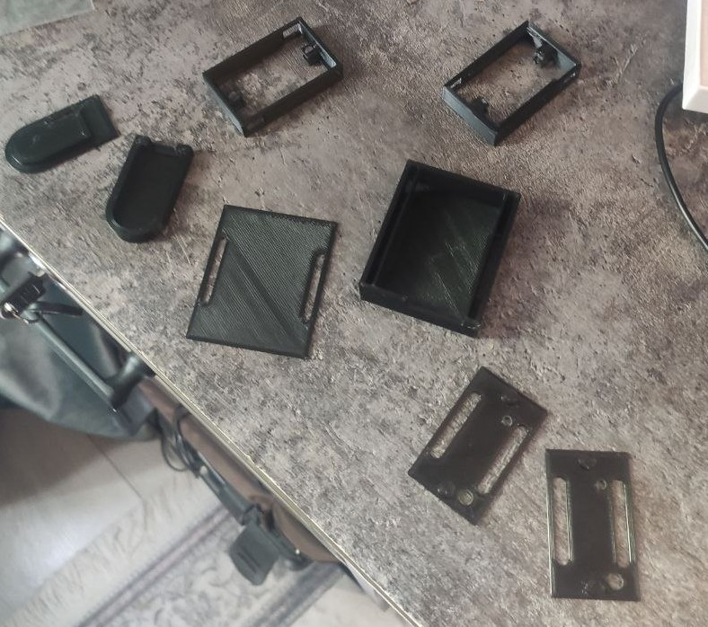

# 🧠 EMG Gesture Classification Project

## 📌 1. Birth of the Idea

<p align="left">
  
</p>

Everything started when I discovered *Orion*, an experimental project by Meta. I was deeply impressed by the level of technology involved — a system combining smart glasses, a neural interface wristband, and compact computing.

This project inspired me to attempt building a similar system on my own.

However, after analyzing its components, I realized that the glasses themselves required advanced expertise in optics and hardware engineering. Instead of tackling the most complex part first, I decided to focus on a more achievable and equally exciting component — the **EMG-based wristband**.

<br clear="left"/>

---

## ⚡ 2. EMG Technology

Electromyography (EMG) is a technique used to measure the electrical activity produced by muscles.

When the brain sends signals to muscles, it does so through electrical impulses. These impulses cause muscles to contract and produce movement. EMG sensors are capable of detecting these signals from the surface of the skin.

Different hand gestures involve different muscle groups. As a result, each gesture produces a unique electrical signal pattern.

<p align="center">
  
</p>

This makes it possible to:
- Capture EMG signals
- Process and extract meaningful features
- Train machine learning models to classify gestures

Such systems can be applied in:
- Human-computer interaction
- Gesture-based control systems
- Assistive technologies

---

## 🔌 3. Hardware: uMyo Sensors

<p align="center">
  
</p>

To avoid building EMG hardware from scratch, I explored existing solutions and discovered **uMyo EMG sensors** developed by *uDevices*.

I acquired two uMyo sensors, which provided a reliable and open-source platform for working with EMG signals.

---

## 🛠️ 4. Working with the EMG Environment

### 🔋 Hardware Setup

The system was powered using:
- 1000 mAh Li-Po battery  
- USB-C Li-Po charger (uDevices)  
- JST PH2.0 connectors for wiring  

<p align="center">
  <video src="YOUR_VIDEO_LINK" width="300" controls></video>
</p>

Additionally, a USB receiver base was used to transmit EMG data to a computer.

<p align="center">
  
</p>

---

### 🧱 Enclosure Design

The initial setup was fragile and exposed. To improve durability and usability, I designed custom enclosures for:
- EMG sensors
- Battery module
- Wrist mounting system

#### 💻 3D Modeling Process

<p align="center">
  
  
  
  
</p>

After completing the designs in Blender, I 3D printed all components.

<p align="center">
  
</p>

---

### 🔧 Final Assembly

After assembling all components, the final device looked like this:

<p align="center">
  <video src="YOUR_FINAL_VIDEO" width="350" controls></video>
</p>

---

### 💻 Software & Signal Processing

The uMyo sensors come with open-source Python code that enables:

- Raw EMG signal acquisition  
- Signal processing  
- Feature extraction  
- Real-time data visualization  

The main entry point is:

```bash
umyo_testing.py
